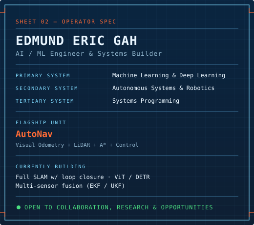

<!-- TITLE SHEET -->

<!-- TYPING -->

  

<!-- STATUS BADGES -->

 

> **GENERAL NOTES** — everything on this sheet is real, runnable code. Nothing here is a stock photo or a claim without a repository behind it. If a project is listed, it exists, it builds, it has tests, and it's linked.

 

## `SHEET 01 — OPERATOR SPEC`

<table>
<tr>
<td width="56%" valign="top">

My work sits at the intersection of **AI / ML engineering**, **from-scratch systems**, and **computer vision** — a real programming language with its own bytecode VM, an agent-observability platform with a calibrated LLM judge, a database engine with an on-disk B+tree, and a 3D globe driven by live space-weather data validated against a real historical geomagnetic storm. Nothing here is a black box I imported without understanding; if it's on this profile, I built the hard part myself.

 

 

 

 

**Flagships:** [**Ember**](https://github.com/Eddiegah/Ember) (language + VM) · [**Flux**](https://github.com/Eddiegah/flux) (live space weather) · [**Loupe**](https://github.com/Eddiegah/loupe) (agent evals) · [**cowrite**](https://github.com/Eddiegah/cowrite) (realtime editor)

Currently building agent tooling on Groq's free tier, more live-data 3D systems, and from-scratch compilers, VMs, and databases. **Open to collaborations, research, and opportunities.**

</td>
<td width="44%" valign="top" align="center">

</td>
</tr>
</table>

## `SHEET 02 — CAPABILITY MATRIX`

<table>
<tr>
<td width="50%" valign="top">

**machine learning &amp; agents**

**from-scratch systems**

</td>
<td width="50%" valign="top">

**systems &amp; engineering**

**tools &amp; delivery**

</td>
</tr>
</table>

**materials &amp; tooling**

 

 

## `SHEET 03 — FLAGSHIP BUILDS`

*Four different disciplines, four different proof points. Every claim below has a test suite or a validated real-world reference behind it — see each repo's README for the receipts.*

<table>
<tr>
<td width="50%" valign="top">

### [Ember](https://github.com/Eddiegah/Ember) — a real language, from scratch

> Lexer → parser → static type checker with closures → bytecode compiler → stack-based VM. An interactive playground shows the live bytecode your code compiles to.

- ✅ Static type checker, incl. closures
- ✅ Real bytecode compiler + stack VM
- ✅ Live playground — see the bytecode

</td>
<td width="50%" valign="top">

### [Flux](https://github.com/Eddiegah/flux) — live space weather, in 3D

> Real NOAA SWPC solar-wind/Kp data drives the actual Shue et al. (1997) magnetopause-compression formula — tested against the real published Gannon superstorm (May 2024) — rendered on a React-Three-Fiber globe.

- ✅ Real NOAA solar-wind feed, live
- ✅ Published physics, validated vs. real storm
- ✅ No database — proxy + client render

</td>
</tr>
<tr>
<td width="50%" valign="top">

### [Loupe](https://github.com/Eddiegah/loupe) — agent observability &amp; evals

> A from-scratch tracing SDK captures every LLM/tool call as a span; a trace-waterfall dashboard visualizes runs; an eval harness grades output with an LLM-judge whose calibration is itself tested against known-good/known-bad answers.

- ✅ Span-nested tracing SDK (AsyncLocalStorage)
- ✅ Run comparison + trace waterfall UI
- ✅ Judge calibration proven by test, not assumed

</td>
<td width="50%" valign="top">

### [cowrite](https://github.com/Eddiegah/cowrite) — realtime collaborative workspace

> The collaborative editor that thinks with you — real-time documents, a code editor, built-in AI, voice calls, and team chat, all in one product-shaped app.

- ✅ Real-time documents + code editor
- ✅ Built-in AI, voice calls, team chat
- ✅ One cohesive, shippable product

</td>
</tr>
</table>

## `SHEET 04 — BILL OF MATERIALS`

80+ original repositories, spanning six things I actually care about: how software is built from the metal/grammar up, how agents are made trustworthy, how machines see, and how any of that helps somewhere real.

**systems, languages &amp; protocols** — *built from the byte/gate up, not wrapped around someone else's library*

| item | spec | description |
|:--|:--:|:--|
| [**Fathom**](https://github.com/Eddiegah/Fathom) |  | A full-text search engine from scratch — inverted index, Porter stemmer, BM25 ranking — over 2,656 real paragraphs from 5 public-domain novels. |
| [**Braid**](https://github.com/Eddiegah/Braid) |  | A real-time collaborative text editor on a from-scratch CRDT (RGA) — three replicas, a chaotic-network simulator, 20 tests proving convergence. |
| [**SproutDB**](https://github.com/Eddiegah/SproutDB) |  | A database engine from scratch — real slotted-page storage, an on-disk B+tree with node splitting, a small SQL layer. Not a wrapper around sqlite3. |
| [**Piecework**](https://github.com/Eddiegah/Piecework) |  | A real peer-to-peer file-sharing protocol — bencoding, SHA-1 piece verification, an HTTP tracker, the actual BitTorrent wire protocol (BEP 3). |
| [**NexaOS**](https://github.com/Eddiegah/NexaOS) |  | A real operating system kernel, written in Rust, from the very first instruction. |
| [**NexaCPU**](https://github.com/Eddiegah/NexaCPU) |  | A real CPU. Every wire. Every gate. Built from scratch. |

**ai &amp; agent engineering** — *tools that make LLMs trustworthy, not just chatty*

| item | spec | description |
|:--|:--:|:--|
| [**ClinicalRAG**](https://github.com/Eddiegah/ClinicalRAG) |  | A citation-grounded clinical Q&amp;A RAG app that refuses to answer when its PubMed corpus doesn't cover the question, instead of guessing. |
| [**PRSentinel**](https://github.com/Eddiegah/PRSentinel) |  | A reusable GitHub Action that reviews pull requests with Gemini and posts real inline comments anchored to actual diff lines. |
| [**Glassbox**](https://github.com/Eddiegah/Glassbox) |  | A hand-written autodiff engine and attention-only transformer, trained to genuinely learn induction heads — see the real attention weights live. |
| [**Glint**](https://github.com/Eddiegah/glint) |  | A terminal chat client built with Ink (React for the TTY) — real token-by-token streaming from a live LLM API. |
| [**mini-chatgpt**](https://github.com/Eddiegah/mini-chatgpt) |  | A GPT-style language model — the same fundamental architecture behind ChatGPT — built from scratch and trained on Shakespeare. |

**live data &amp; real physics** — *real feeds and real formulas, running in your browser*

| item | spec | description |
|:--|:--:|:--|
| [**Radiant**](https://github.com/Eddiegah/radiant) |  | A from-scratch Monte Carlo path tracer — a white-furnace test and a 1/√N convergence-rate check prove the renderer is physically correct. |
| [**PulseGlobe**](https://github.com/Eddiegah/PulseGlobe) |  | Earth's seismic activity, live — a real-time 3D globe streaming the USGS earthquake feed. |
| [**satellitepulse**](https://github.com/Eddiegah/satellitepulse) |  | A true-to-scale 3D globe of real satellites, propagated live from real orbital data via SGP4. |
| [**flightpulse**](https://github.com/Eddiegah/flightpulse) |  | A live 3D globe of every commercial and general-aviation flight in the air, streamed from real ADS-B tracking data. |
| [**PhysicsLab**](https://github.com/Eddiegah/PhysicsLab) |  | GPU-accelerated Navier–Stokes fluid dynamics and mass-spring cloth mechanics, running entirely in-browser. |
| [**OrbitLive**](https://github.com/Eddiegah/OrbitLive) |  | The solar system, right now — real orbital mechanics, flyable in 3D. |

**computer vision &amp; perception** — *the computer watches, you don't touch anything*

| item | spec | description |
|:--|:--:|:--|
| [**Vigil**](https://github.com/Eddiegah/vigil) |  | A fully client-side driver drowsiness monitor — real MediaPipe landmarks, Eye Aspect Ratio, PERCLOS — proven to discriminate open vs. closed eyes on real photos. |
| [**sign-language-translator**](https://github.com/Eddiegah/sign-language-translator) |  | Translates American Sign Language alphabet letters in real time from a webcam, via MediaPipe and a PyTorch neural network. |
| [**gesture-control**](https://github.com/Eddiegah/gesture-control) |  | Real-time hand gesture control for presentations and media — point, swipe, pinch. No mouse, no keyboard. |
| [**GazeType**](https://github.com/Eddiegah/GazeType) |  | Turns a regular webcam into a hands-free typing interface — hold your gaze on a key, it fires. |
| [**Aura**](https://github.com/Eddiegah/Aura) |  | Light that flows from your face and hands, live — real pretrained CV tracking driving a generative visual. |

**health &amp; scientific ml** — *models pointed at problems that matter, with the uncertainty shown honestly*

| item | spec | description |
|:--|:--:|:--|
| [**SymFM**](https://github.com/Eddiegah/SymFM) |  | A physics-informed foundation model for discovering governing equations from data — Lorenz-96, SINDy, KAN, active subspace projection. |
| [**ProteinLens**](https://github.com/Eddiegah/ProteinLens) |  | Explores cancer protein structures and scores point mutations, powered by Meta's ESM2 protein language model. |
| [**reliable-ml-distribution-shift**](https://github.com/Eddiegah/reliable-ml-distribution-shift) |  | Uncertainty-aware ML for health-risk prediction under real distribution shift — BRFSS data, a genuine temporal split, conformal prediction. |
| [**GalamseySentinel**](https://github.com/Eddiegah/GalamseySentinel) |  | Satellite intelligence for detecting illegal mining activity in Ghana. |

## `SHEET 05 — ACTIVITY LOG`

| in progress | building next | reference material |
|:---:|:---:|:---:|
| Agent tooling &amp; eval harnesses | More from-scratch compilers/VMs | Crafting Interpreters (Nystrom) |
| Live-data 3D systems | A database with real transactions | Designing Data-Intensive Apps (Kleppmann) |
| Computer-vision perception apps | Multi-agent orchestration | Attention Is All You Need |
| Health-ML under distribution shift | Open source contributions | SLAM &amp; robotics papers |

 

  

**real language mix across 80+ repos** — counted straight from the repo list, not estimated

  

<picture>
  <source media="(prefers-color-scheme: dark)"  srcset="https://raw.githubusercontent.com/Eddiegah/Eddiegah/output/github-contribution-grid-snake-dark.svg"/>
  <source media="(prefers-color-scheme: light)" srcset="https://raw.githubusercontent.com/Eddiegah/Eddiegah/output/github-contribution-grid-snake.svg"/>
  
</picture>

## `SHEET 06 — SIGN-OFF`

  

> *"Intelligence is not in the destination — it's in how you navigate to it."*
>
> *— Edmund Eric Gah*

 

 

<!-- END OF DRAWING SET -->

