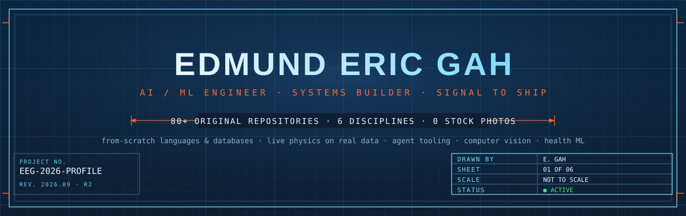
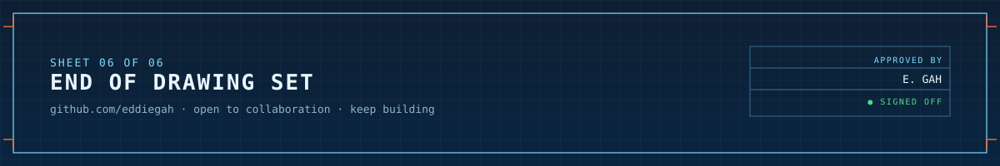

<!-- BOOT SEQUENCE HERO -->


<div align="center">

<!-- TYPING -->


<br/><br/>

<!-- STATUS BADGES -->


<a href="https://github.com/Eddiegah?tab=followers"></a>

</div>

<br/>

```diff
+ root@eddiegah:~$ cat /etc/motd
```

> A machine learning engineer who doesn't stop at the model — also builds the CPU it runs on,
> the kernel that schedules it, and the compiler that ships it. Everything below is real,
> runnable, and one click away.

<br/>

## `$ whoami`


```yaml
name     : Edmund Eric Gah
alias    : Eddiegah
role     : AI / ML Engineer & Systems Builder

focus:
  primary   : Machine Learning & Deep Learning
  secondary : Autonomous Systems & Robotics
  tertiary  : Systems Programming (kernels, CPUs, compilers)

flagship  : AutoNav — autonomous navigation stack
            (Visual Odometry + LiDAR + A* + Control)

also_built:
  - a real OS kernel, in Rust, from the first instruction
  - a real CPU, every gate, in Verilog
  - a compiled language with symbolic differentiation
  - GPT and Vision Transformers, from scratch
  - live sims: orbits, flocking, fluid dynamics, seismic data

learning:
  - full SLAM with loop closure
  - transformer architectures (ViT, DETR)
  - multi-sensor fusion (EKF/UKF)
  - large language models

fun_fact  : my code drives cars, flies through orbits, and
            occasionally boots its own operating system
open_to   : collaborations, research, opportunities
```

<br clear="right"/>

## `$ cat /proc/skills`

<table>
<tr>
<td width="50%" valign="top">

**machine learning**


**autonomous systems**


</td>
<td width="50%" valign="top">

**systems & engineering**


**tools**


</td>
</tr>
</table>

## `$ cat tech_stack.txt`

<div align="center">

**ai / ml / vision**


**systems & low-level**


**web & devops**


</div>

## `$ systemctl status autonav.service`

<table>
<tr>
<td width="58%">

### [AutoNav — Autonomous Navigation Stack](https://github.com/Eddiegah/AutoNav)

> A complete perception-to-planning pipeline for simulated autonomous driving. Built for the **CARLA** Unreal Engine simulator, with a self-contained Python mock so it runs instantly — no download required.

```
📷 Camera  ──▶  Visual Odometry (ORB features + Essential Matrix)
                        │
📡 LiDAR   ──▶  Occupancy Grid  (log-odds + Bresenham ray tracing)
                        │
               🗺️  A* Path Planner  (costmap inflation)
                        │
               🎮  Pure Pursuit Controller  (adaptive lookahead)
                        │
                    🚗  Vehicle reaches goal
```

[](https://github.com/Eddiegah/AutoNav/actions/workflows/ci.yml)
[](https://python.org)
[](https://github.com/Eddiegah/AutoNav/blob/master/LICENSE)

</td>
<td width="42%" align="center" valign="top">

<br/>

**highlights**

| feature | status |
|:--------|:------:|
| Visual Odometry (ORB) | ✅ |
| LiDAR Occupancy Grid | ✅ |
| A\* Path Planning | ✅ |
| Pure Pursuit Control | ✅ |
| Live Dashboard (OpenCV) | ✅ |
| Mock Simulator | ✅ |
| CI / CD Pipeline | ✅ |
| Honest drift reporting | ✅ |

<br/>

[](https://github.com/Eddiegah/AutoNav)

</td>
</tr>
</table>

## `$ ls -la ~/projects/`

67+ original repositories, spanning five things I actually care about: how machines see, how they move, how they're built from the metal up, and how any of that helps somewhere that matters.

**systems & low-level** — *built from the gate/instruction up*

| project | built with | what it is |
|:--|:--:|:--|
| [**NexaOS**](https://github.com/Eddiegah/NexaOS) |  | A real operating system kernel, written in Rust, from the very first instruction. |
| [**NexaCPU**](https://github.com/Eddiegah/NexaCPU) |  | A real CPU. Every wire. Every gate. Built from scratch. |
| [**Vect**](https://github.com/Eddiegah/Vect) |  | A compiled language with native vectors, matrices, and symbolic differentiation. |
| [**DiscreteALU**](https://github.com/Eddiegah/DiscreteALU) |  | An 8-bit ALU built from the transistor up — simulated in SPICE, visualized in 3D. |

**ai/ml from first principles** — *no black-box libraries doing the hard part*

| project | built with | what it is |
|:--|:--:|:--|
| [**mini-chatgpt**](https://github.com/Eddiegah/mini-chatgpt) |  | A GPT-style language model — the same fundamental architecture behind ChatGPT — built from scratch and trained on Shakespeare. |
| [**ViT-From-Scratch**](https://github.com/Eddiegah/ViT-From-Scratch) |  | Multi-head self-attention and patch embedding, hand-implemented — no `nn.MultiheadAttention`. Trained on CIFAR-10. |
| [**AttentionLab**](https://github.com/Eddiegah/AttentionLab) |  | How transformers actually work — real attention math, computed live on whatever you type. |

**live & interactive simulations** — *real physics, running in your browser*

| project | built with | what it is |
|:--|:--:|:--|
| [**PulseGlobe**](https://github.com/Eddiegah/PulseGlobe) |  | Earth's seismic activity, live — a real-time 3D globe streaming the USGS earthquake feed. |
| [**OrbitLive**](https://github.com/Eddiegah/OrbitLive) |  | The solar system, right now — real orbital mechanics, flyable in 3D. |
| [**Murmuration**](https://github.com/Eddiegah/Murmuration) |  | Thousands of birds, actually flocking — real Reynolds boids algorithm, live. |
| [**PhysicsLab**](https://github.com/Eddiegah/PhysicsLab) |  | GPU-accelerated Navier–Stokes fluid dynamics and cloth mechanics, entirely in-browser. |

**perception & human interfaces** — *the computer watches, you don't touch anything*

| project | built with | what it is |
|:--|:--:|:--|
| [**Aura**](https://github.com/Eddiegah/Aura) |  | Light that flows from your face and hands, live — real pretrained CV tracking. |
| [**GazeType**](https://github.com/Eddiegah/GazeType) |  | Turns a regular webcam into a hands-free typing interface — hold your gaze on a key, it fires. |
| [**gesture-control**](https://github.com/Eddiegah/gesture-control) |  | Real-time hand gesture control for presentations — point, swipe, pinch. No mouse, no keyboard. |

**health & scientific ml** — *models pointed at problems that matter*

| project | built with | what it is |
|:--|:--:|:--|
| [**ProteinLens**](https://github.com/Eddiegah/ProteinLens) |  | Explores cancer protein structures and scores point mutations, powered by Meta's ESM2 protein language model. |
| [**GalamseySentinel**](https://github.com/Eddiegah/GalamseySentinel) |  | Satellite intelligence for detecting illegal mining activity in Ghana. |
| [**SymFM**](https://github.com/Eddiegah/SymFM) |  | A physics-informed foundation model for discovering governing equations from data. |

<div align="center">

[](https://github.com/Eddiegah?tab=repositories&type=source)

</div>

## `$ crontab -l`

<div align="center">

| learning | building | reading |
|:---:|:---:|:---:|
| Full SLAM with loop closure | AutoNav v2 — dynamic obstacles | Attention Is All You Need |
| Vision Transformers (ViT) | ML pipeline tooling | Deep Learning (Goodfellow) |
| Extended Kalman Filter | Sensor fusion module | Planning Algorithms (LaValle) |
| LLM fine-tuning & agents | Open source contributions | SLAM papers (Cadena et al.) |

</div>

## `$ git log --graph --stat --all`

<div align="center">


<br/><br/>

<picture>
  <source media="(prefers-color-scheme: dark)"  srcset="https://raw.githubusercontent.com/Eddiegah/Eddiegah/output/github-contribution-grid-snake-dark.svg"/>
  <source media="(prefers-color-scheme: light)" srcset="https://raw.githubusercontent.com/Eddiegah/Eddiegah/output/github-contribution-grid-snake.svg"/>
  
</picture>

</div>

## `$ fortune`

<div align="center">


<br/><br/>

> *"Intelligence is not in the destination — it's in how you navigate to it."*
>
> *— Edmund Eric Gah*

</div>

## `$ finger eddiegah@github.com`

<div align="center">

[](https://github.com/Eddiegah)
[](https://github.com/Eddiegah/AutoNav)
[](mailto:gahedmund146@gmail.com)

<br/>


</div>

<!-- SESSION CLOSED FOOTER -->

